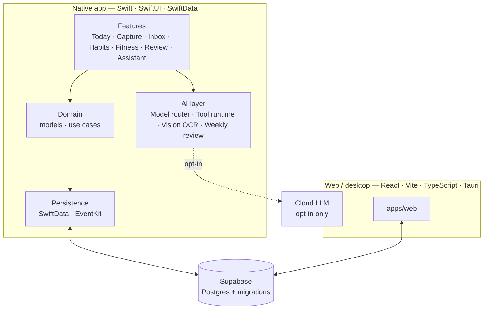

<div align="center">

# LEO

**The calendar that thinks. The to-do list that talks back.**


[](LICENSE)

</div>

---

LEO is an AI-first personal operating system for your time. It unifies tasks, calendar events, reminders, alarms, recurring commitments, deadlines, and habits into **one timeline** — paired with an assistant that can actually *plan* with you, not just parse what you type.

Most productivity apps understand one slice of your life: Reminders does checkboxes, Fantastical does calendar, TickTick does tasks. LEO's thesis is simple — everything you owe your future self belongs on the same surface, and an AI that understands all of it is more useful than five apps that each understand one slice.

## Why LEO

- **One timeline, one truth.** Today shows time-blocked events, due-today tasks, today's habits, and alarms — no tabs to switch between domains.
- **The AI plans, it doesn't just parse.** "gym MWF 7am for an hour" and "draft the report by Friday" both just work. "Plan my week" understands your actual constraints.
- **Local-first, private by default.** Data lives on-device / in your own Supabase project. Cloud AI is opt-in and never sees raw content unless you invoke it.
- **Honors the OS.** Built on EventKit, App Intents, WidgetKit, Shortcuts — not a parallel universe bolted onto your phone.

## Features

| Area | What it does |
|---|---|
| **Today** | A single timeline of events, tasks, habits and alarms for the day |
| **Capture & Inbox** | Add anything in seconds — typed text, natural language, or a photo (on-device OCR via Vision) |
| **Recurrence engine** | Repeating tasks, events and commitments ("gym MWF 7am") |
| **Habits** | Track daily and weekly habits on the same surface as everything else |
| **Fitness** | A built-in gym companion for workouts |
| **AI assistant** | Chat-based planning, plus an AI-generated weekly review |
| **Calendar integration** | Reads and writes your iOS calendars through EventKit |

## Architecture



**How the AI works.**
- **Cost-aware model routing.** An `AIRouter` picks the cheapest Claude model that can do the job — Haiku for quick parsing and summaries, Sonnet for single-step tool use, Opus for long multi-step planning — with a manual override in settings.
- **Tool use, not just text.** The assistant reads your schedule and *proposes* changes through typed tools (read tools, propose tools, and fitness tools such as workout and meal plans). Proposals are reviewed before they touch your data.
- **On-device OCR.** Photo capture uses Apple's Vision framework locally.
- **Weekly review.** A generator summarises your week from your own timeline.

## Platforms

| Target | Stack | Location |
|---|---|---|
| iOS / macOS (native) | Swift, SwiftUI, SwiftData, EventKit | `LEO/` |
| Web / desktop | React, Vite, TypeScript, Tauri | `apps/web/` |
| Backend | Supabase (Postgres, migrations) | `supabase/` |

## Getting started

### iOS / macOS

1. Open `LEO.xcodeproj` in Xcode.
2. Copy `Config/Secrets.xcconfig.example` to `Config/Secrets.xcconfig` and fill in your own Supabase anon key.
3. Build and run the `LEO` (iOS) or `LEOMac` (macOS) scheme.

### Web (native Mac app via Tauri)

```bash
cd apps/web
pnpm install
pnpm tauri dev
```

Requires the Rust toolchain (`rustup`) for the native shell. To run it as a plain browser app instead:

```bash
cd apps/web
pnpm dev
```

### Backend

Database schema and migrations live in `supabase/migrations/`. Point the app at your own Supabase project — see `supabase/README.md` for setup.

## Quality

- **Linting** with SwiftFormat and SwiftLint (`.swiftformat`, `.swiftlint.yml`) — run locally before committing.
- **Tests** across the native app (`LEOTests`, `LEOUITests`, `LEOMacTests`) and the web app.
- Conventions for humans and AI coding agents are documented in [`AGENTS.md`](AGENTS.md).

## Status & roadmap

LEO is in active development and approaching its first public release. Milestones run from foundation (M0) through AI assistant (M4), habits and weekly review (M5), a Gym Companion (M8) and App Store launch (M9).

## Project docs

- [`PRD.md`](PRD.md) — product requirements and positioning
- [`ROADMAP.md`](ROADMAP.md) — milestone plan
- [`AGENTS.md`](AGENTS.md) — conventions for AI coding agents working in this repo
- [`plans/`](plans) — per-milestone implementation plans

## Contributing

Contributions are welcome — see [`CONTRIBUTING.md`](CONTRIBUTING.md) to get started.

## License

MIT — see [`LICENSE`](LICENSE).

---

<div align="center">

Built by **Souraj Pal** · [GitHub](https://github.com/cureius) · [LinkedIn](https://www.linkedin.com/in/souraj-pal/)

</div>
